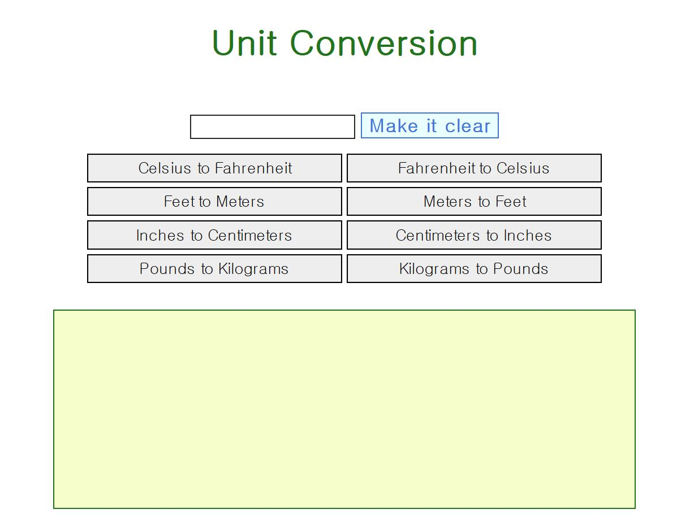
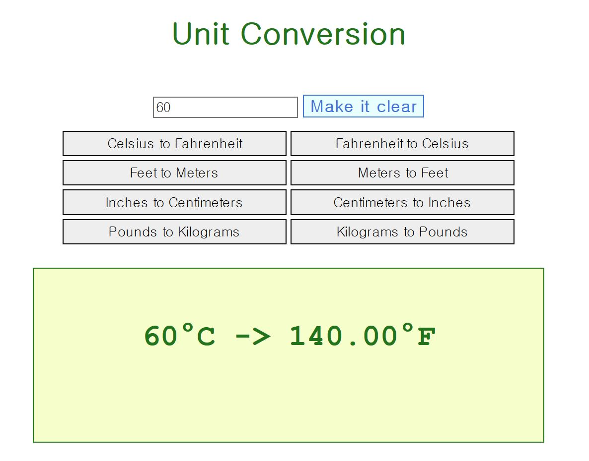
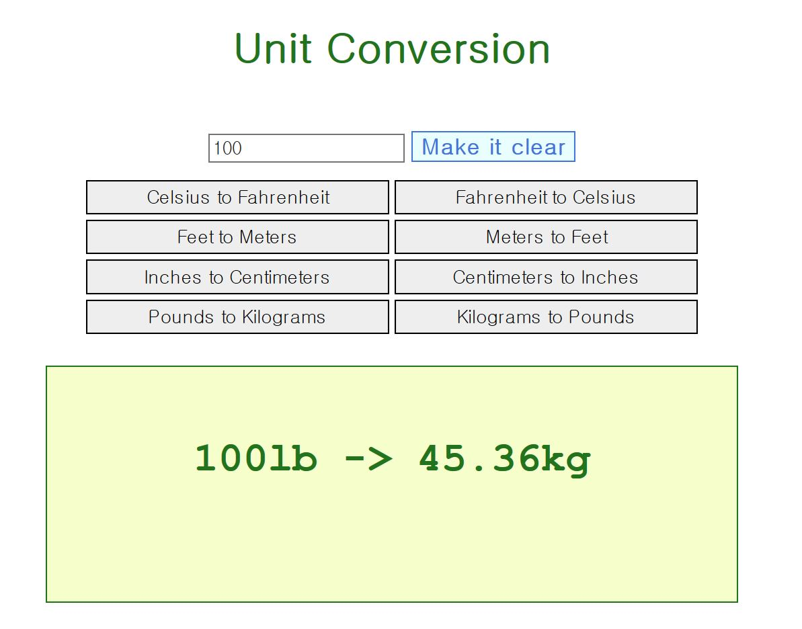

# JavaScript
# HTML5 / CSS / JavaScript  

1. index.html - simple Rock-Scissors-Paper Game with computer
----------------------------------------

    - user choose one
    - page shows who win

2. unit.html - Unit Conversion 
-----------------------------------------

    - user enter number to convert 
    - page return result for the converted number

